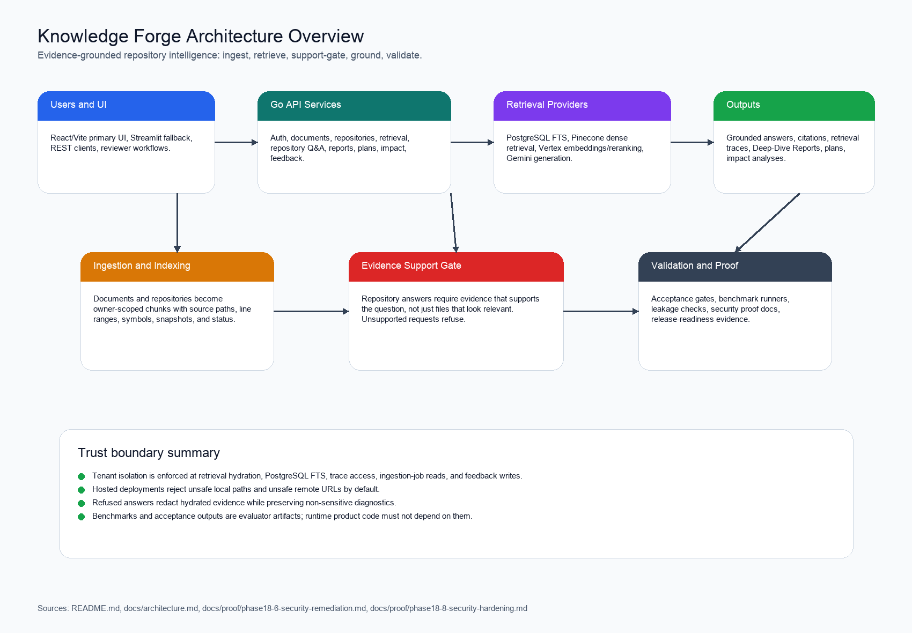
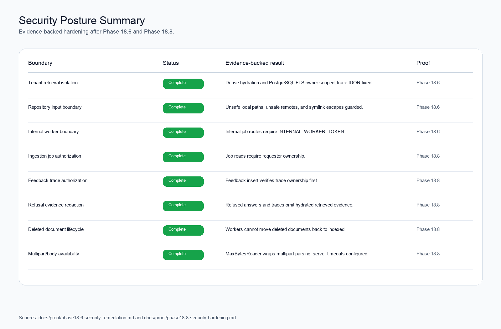
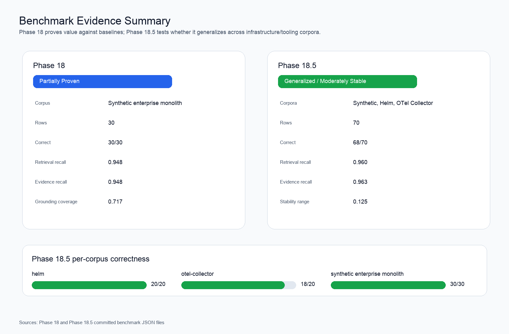
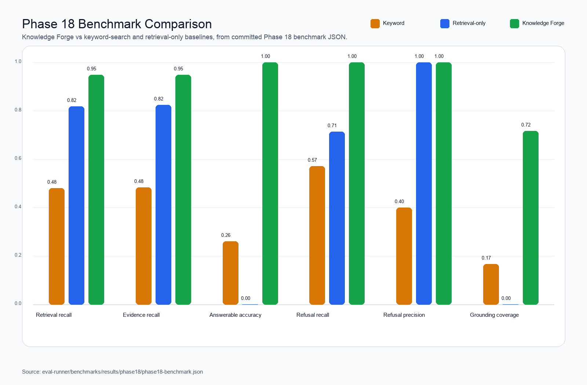

# Knowledge Forge

Knowledge Forge is an evidence-grounded repository intelligence platform.

It indexes documents and source repositories, retrieves source evidence, answers
architecture and code questions with citations, generates repository Deep-Dive
Reports, and produces read-only implementation plans and impact analyses. The
project is built as a production-style Go and GenAI/RAG system: the useful unit
is not a fluent answer, but a claim that can be traced back to files, line
ranges, repository snapshots, citations, and validation evidence.

One-sentence value proposition:

```text
Knowledge Forge helps engineers ask hard questions about a repository and trust
the answer because every useful claim is tied back to source evidence.
```

Current maturity snapshot:

| Area | Current Status |
| --- | --- |
| Product correctness | Phase 17 accepted: 6/6 gates, 0 evaluator issues |
| Benchmark value | Phase 18 partially proven against keyword and retrieval-only baselines |
| Multi-corpus proof | Phase 18.5 generalized within infrastructure/tooling scope and was moderately stable |
| Security posture | Phase 18.6 tenant isolation and Phase 18.8 hardening complete |
| Release readiness | Phase 18.7 READY |
| Roadmap | Phase 19 Larger Corpus Expansion selected, not started |

The repository is intentionally evidence-heavy. The fastest way to understand
the project is:

1. Read this README for the product, architecture, setup, proof summary, and
   roadmap.
2. Open [docs/README.md](docs/README.md) for the curated documentation map.
3. Open [docs/readiness-scorecard.md](docs/readiness-scorecard.md) for the
   current maturity scorecard.
4. Open [docs/roadmap.md](docs/roadmap.md) for completed, selected, candidate,
   rejected, and not-started work.

## Why This Project Exists

Most AI code assistants are easy to impress with and hard to trust. They can
explain a codebase convincingly even when they retrieved the wrong files, missed
important context, or mixed repository evidence with outside knowledge.
Knowledge Forge is built around a stricter operating rule:

```text
Claims require evidence.

If evidence is insufficient:
- refuse unsupported conclusions
- explain what context is missing
- keep citations, traces, and validation artifacts reviewable
```

That makes the system useful for codebase onboarding, architecture review,
repository due diligence, implementation planning, impact analysis, and
interview or portfolio demonstrations where trust matters more than prose.

Target users:

- engineers joining or reviewing a complex repository
- staff engineers and tech leads evaluating architecture or risk
- platform teams that need source-grounded implementation planning
- reviewers who want to inspect evidence, citations, traces, and benchmark
  results rather than accept AI answers at face value
- interviewers or portfolio reviewers who want to see production-style RAG
  engineering, not just a chatbot demo

Non-goals:

- autonomous code changes
- PR creation or code generation
- graph retrieval by default
- static code intelligence by default
- broad claims across every repository type before broader corpus evidence
- unsupported answers that rely on external or stale knowledge instead of
  repository evidence

## North-Star Workflow

```text
Index repository
-> Ask an architecture or code question
-> Inspect cited evidence
-> Generate a Deep-Dive Report
-> Generate an implementation plan
-> Generate an impact analysis
-> Validate the output against benchmarks and acceptance gates
```

The validated product supports repository import, repository Q&A, Deep-Dive
Reports, evidence inspection, implementation planning, impact analysis,
retrieval traces, acceptance validation, benchmark proof, release-readiness
documentation, and security-hardening proof.

## Product Capabilities

### Document RAG

Knowledge Forge supports a conventional enterprise-document RAG path:

- upload text-like documents
- chunk and store content in PostgreSQL
- embed chunks
- retrieve with vector search and PostgreSQL full text search
- answer with grounded citations
- inspect retrieval traces and evaluation runs

This path is useful for company knowledge bases, policy documents, and
source-backed Q&A.

### Repository Intelligence

The repository-intelligence path indexes source repositories and ties every
answer to repository evidence:

- repository owner and branch
- immutable commit SHA snapshot
- source files and file versions
- chunks with file paths and line ranges
- symbols when available
- retrieval traces and provenance
- cited excerpts used in answers, reports, plans, and impact analysis

Repository Q&A is designed for questions such as:

- Where is authentication implemented?
- How does repository ingestion work?
- Which files are involved if this dependency changes?
- What source evidence supports the API layer?
- What context is missing before claiming a database layer exists?

Unsupported questions should refuse rather than invent evidence.

### Deep-Dive Reports

A Deep-Dive Report is a cited repository due-diligence artifact. It starts with
one shared evidence pass, performs targeted follow-up retrieval for weak
sections, and returns structured JSON plus Markdown export.

The report covers:

- architecture overview
- API/UI/retrieval layers
- entry points
- main packages and services
- authentication flow
- data layer
- external services
- testing strategy
- risks and missing context
- evidence quality
- claim grounding

Reports are generated on demand in v1. They are not persisted as first-class
database objects; durable review data comes from repository snapshots,
citations, retrieval traces, provenance, and validation outputs.

### Planning And Impact Analysis

Knowledge Forge can produce read-only implementation plans and impact analyses
from repository evidence. These workflows do not mutate code, open PRs, run
agents, or generate patches. They summarize observed evidence, likely affected
files, missing context, test considerations, and risks.

## Architecture At A Glance



```text
User
-> React/Vite UI or API
-> Go Chi backend
-> auth, document, repository, retrieval, report, plan, impact services
-> PostgreSQL + PostgreSQL FTS
-> Pinecone vector search
-> Vertex AI embeddings/ranking/Gemini
-> grounded response, citations, traces, and validation artifacts
```

Core stack:

- Go, Chi, pgx, sqlc, Goose
- PostgreSQL and PostgreSQL full text search
- Pinecone vector search
- Vertex AI embeddings, Vertex Ranking API, and Gemini
- provider interfaces around cloud SDKs
- React/Vite primary UI
- Streamlit fallback UI
- Python benchmark and acceptance runners
- Docker Compose for local operation
- Cloud Run, Cloud SQL, Cloud Tasks, Secret Manager, Cloud Trace/Monitoring,
  Vertex AI, and Pinecone for the documented GCP deployment path

The detailed architecture lives in:

- [Architecture](docs/architecture.md)
- [High-Level Design and Component Design](docs/02-hld-component-design.md)
- [Low-Level Design](docs/04-lld.md)
- [Database Design and Schema](docs/05-db-design-schema.md)

## Repository Data Model

```text
Repository
+-- Branch
    +-- Snapshot(commit SHA)
        +-- Files
        +-- Chunks
        +-- Symbols
        +-- Graph
```

The graph field exists in the repository model, but full graph retrieval is not
validated as a selected roadmap direction. Current benchmark evidence does not
justify graph retrieval until graph-specific failures dominate measured results.

## Retrieval Flow

Document RAG uses hybrid retrieval:

```text
Question
-> question rewriting
-> Vertex query embedding
-> Pinecone dense retrieval
+
PostgreSQL FTS retrieval
-> reciprocal rank fusion
-> optional Vertex reranking
-> Gemini grounded generation
-> response with citations
```

Repository Q&A uses a stricter support contract:

```text
repository question
-> query classification
-> adaptive retrieval budget
-> repository/snapshot-scoped retrieval
-> optional reranking
-> evidence support gate
-> token-budgeted context assembly
-> grounded answer, report, plan, or impact output
```

Important rule:

```text
evidence exists != evidence supports the question
```

For example, a payroll UI question cannot be supported merely by a UI file. It
requires payroll-domain evidence. A revenue API question cannot be supported
merely by an API handler. It requires revenue-domain endpoint evidence.

## Security And Trust Boundaries

The current security posture is documented and regression-tested through Phase
18.6 and Phase 18.8 proof artifacts.



Implemented guardrails include:

- owner-scoped dense retrieval hydration
- owner-scoped PostgreSQL FTS retrieval
- retrieval trace authorization
- deleted-document retrieval revocation
- repository ingestion input validation
- local path restrictions for hosted deployments
- approved HTTPS Git remote hosts
- symlink escape prevention
- internal worker token enforcement
- refusal-path evidence redaction
- ingestion job and feedback trace ownership checks
- multipart upload body caps and server timeouts

Security proof:

- [Phase 18.6 Security Remediation](docs/proof/phase18-6-security-remediation.md)
- [Phase 18.8 Security Hardening](docs/proof/phase18-8-security-hardening.md)

## Validation And Evidence

Knowledge Forge has validation in four layers:

1. Unit and integration-style project tests.
2. Acceptance gates for refusal, answer relevance, architecture evidence,
   metric integrity, label completeness, and adversarial benchmark behavior.
3. Benchmark proof against keyword and retrieval-only baselines.
4. Security and release-readiness proof artifacts.

Current milestone evidence:

| Area | Status | Evidence |
| --- | --- | --- |
| Product conformance | Complete | [Phase 17 Validation Proof](docs/proof/phase17-validation.md) |
| Benchmark value | Partially Proven | [Phase 18 Benchmark Proof](docs/evaluations/phase18-benchmark-proof.md) |
| Multi-corpus generalization | Generalized within infrastructure/tooling scope, Moderately Stable | [Phase 18.5 Multi-Corpus Benchmark](docs/evaluations/phase18-5-multi-corpus-benchmark.md) |
| Tenant isolation | Complete | [Phase 18.6 Security Remediation](docs/proof/phase18-6-security-remediation.md) |
| Release readiness | READY | [Phase 18.7 Release Readiness](docs/proof/phase18-7-release-readiness.md) |
| Security hardening | Complete | [Phase 18.8 Security Hardening](docs/proof/phase18-8-security-hardening.md) |
| Roadmap decision | Larger Corpus Expansion selected, with reservations from independent challenge review | [Phase 19 Planning Review](docs/proof/phase19-planning-review.md), [Independent Roadmap Challenge](docs/proof/independent-roadmap-challenge.md) |

The important limitation is explicit: current benchmark evidence is strongest
for infrastructure, platform, and developer-tooling repositories. It does not
yet prove performance across all repository types.

### Benchmark Summary





Phase 18 answered whether Knowledge Forge retrieves and grounds repository
evidence better than simple baselines on the synthetic enterprise monolith. The
answer was `Partially Proven`: Knowledge Forge materially improved
architecture, dependency/impact, and grounding categories, but did not
materially outperform the stronger retrieval-only baseline for refusal behavior.

Phase 18.5 answered whether those gains generalized beyond the synthetic
fixture. The answer was `Generalized` within the infrastructure/platform/
developer-tooling scope and `Moderately Stable` across synthetic, Helm, and
OpenTelemetry Collector corpora.

Key benchmark facts from committed result artifacts:

| Evidence | Result |
| --- | --- |
| Phase 18 rows | 30 frozen synthetic-monolith rows |
| Phase 18 correctness | 30/30 Knowledge Forge rows correct in the saved proof pack |
| Phase 18.5 rows | 70 rows: 30 synthetic, 20 Helm, 20 OTel Collector |
| Phase 18.5 correctness | 68/70 Knowledge Forge rows correct |
| Phase 18.5 per corpus | Helm 20/20, OTel Collector 18/20, synthetic 30/30 |
| Phase 18.5 stability | `Moderately Stable`, max primary-metric range 0.125 |

The benchmark source of truth remains the committed JSON/Markdown under
`eval-runner/benchmarks/results/phase18/` and
`eval-runner/benchmarks/results/phase18_5/`. The images in this README are
rendered summaries of those committed results, not new benchmark outputs.

### Evidence Trail

| Milestone | What It Proved | Canonical Evidence |
| --- | --- | --- |
| Phase 17 | Product conformance: 6/6 gates, 0 evaluator issues | [Phase 17 Validation Proof](docs/proof/phase17-validation.md) |
| Phase 18 | Value against keyword and retrieval-only baselines | [Phase 18 Benchmark Proof](docs/evaluations/phase18-benchmark-proof.md) |
| Phase 18.5 | Multi-corpus generalization within infrastructure/tooling scope | [Phase 18.5 Multi-Corpus Benchmark](docs/evaluations/phase18-5-multi-corpus-benchmark.md) |
| Phase 18.6 | Tenant isolation and deployment trust-boundary remediation | [Phase 18.6 Security Remediation](docs/proof/phase18-6-security-remediation.md) |
| Phase 18.7 | Release readiness across architecture, security, benchmarks, docs, onboarding, and deployment | [Phase 18.7 Release Readiness](docs/proof/phase18-7-release-readiness.md) |
| Phase 18.8 | Medium-severity security hardening: IDOR, refusal leakage, lifecycle, upload limits | [Phase 18.8 Security Hardening](docs/proof/phase18-8-security-hardening.md) |
| Phase 19 planning | Larger Corpus Expansion selected as the next evidence-gathering direction | [Phase 19 Planning Review](docs/proof/phase19-planning-review.md) |
| Independent challenge | The Phase 19 decision survived adversarial review with reservations | [Independent Roadmap Challenge](docs/proof/independent-roadmap-challenge.md) |

## Run Locally

Prerequisites:

- Go
- Python 3
- Node.js and npm
- Docker and Docker Compose

Important local defaults:

| Setting | Local / Safe Default | Meaning |
| --- | --- | --- |
| `DATABASE_URL` | from `.env.example` / Docker Compose | PostgreSQL connection |
| `PINECONE_API_KEY` | optional for mock/local tests | Dense retrieval provider key |
| `VERTEX_PROJECT_ID` / Vertex settings | optional for mock/local tests | Gemini, embeddings, and reranking provider config |
| `ALLOW_LOCAL_REPOSITORY_PATHS` | `false` for hosted deployments | Prevents hosted users from indexing server-local paths |
| `ALLOWED_GIT_REMOTE_HOSTS` | approved Git hosts only | Restricts clone targets |
| `INTERNAL_WORKER_TOKEN` | required for internal worker routes in hosted deployments | Protects worker job-processing endpoints |

Start with the local mock-provider path:

```bash
cp .env.example .env
make tidy
make migrate-up
make test
docker compose up --build
```

Default local services:

- API: `http://localhost:8080`
- API health check: `GET /healthz`
- React/Vite UI through Docker Compose: `http://localhost:8501`
- Streamlit fallback source: `ui/streamlit`
- PostgreSQL: `localhost:5432`

Real Vertex AI and Pinecone integration tests are environment-gated so the local
test suite can run without cloud credentials.

## Run Validation

Core validation:

```bash
make test
make vet
python3 -m pytest eval-runner
python3 -m py_compile ui/streamlit/app.py
cd ui/web && npm test && npm run lint && npm run build
docker compose config
make validate-acceptance
```

Repository benchmark runner:

```bash
python3 eval-runner/repo_benchmark_runner.py \
  --input eval-runner/benchmarks/results/phase18_5/knowledge_forge_candidate.jsonl \
  --baseline keyword=eval-runner/benchmarks/results/phase18_5/keyword_baseline.jsonl \
  --baseline retrieval_only=eval-runner/benchmarks/results/phase18_5/retrieval_only_baseline.jsonl \
  --output /tmp/phase18_5-benchmark.json \
  --report-output /tmp/phase18_5-benchmark.md
```

Acceptance methodology:

- [Acceptance Methodology](docs/evaluations/acceptance-methodology.md)

## Main API Surface

Authentication and user context:

- `POST /auth/login`
- `GET /me`

Document RAG:

- `POST /documents`
- `GET /documents`
- `GET /debug/retrieval`
- `POST /eval/runs`

Repository intelligence:

- `POST /v1/repositories`
- `POST /v1/repositories/{repository_id}/ingestions`
- `GET /v1/ingestions/{job_id}`
- `POST /v1/ask`
- `POST /v1/reports/deep-dive`
- `POST /v1/plans`
- `POST /v1/impact`
- `GET /v1/retrieval-traces/{trace_id}`
- `POST /v1/feedback`

Internal worker routes require `INTERNAL_WORKER_TOKEN` and are not public API.

## Deploy Safely

The documented production target is GCP:

- Cloud Run for API, worker, migration job, and UI
- Cloud SQL PostgreSQL
- Secret Manager
- Cloud Tasks
- Cloud Trace/Monitoring
- Vertex AI
- Pinecone

Hosted defaults should keep:

- `ALLOW_LOCAL_REPOSITORY_PATHS=false`
- `INTERNAL_WORKER_TOKEN` backed by Secret Manager
- `ALLOWED_GIT_REMOTE_HOSTS` restricted to approved Git hosts

Deployment docs:

- [Deployment Overview](deploy/README.md)
- [Cloud Run Deployment](deploy/cloud-run.md)

## Documentation Map

Start here:

- [Documentation Index](docs/README.md)
- [Readiness Scorecard](docs/readiness-scorecard.md)
- [Roadmap](docs/roadmap.md)

Product and architecture:

- [Architecture](docs/architecture.md)
- [Functional and Non-Functional Requirements](docs/01-fr-nfr-scale-estimation.md)
- [High-Level Design](docs/02-hld-component-design.md)
- [Use Cases and Sequence Diagrams](docs/03-usecases-sequence-diagrams.md)
- [Low-Level Design](docs/04-lld.md)
- [Database Design and Schema](docs/05-db-design-schema.md)
- [UI and Backend Quality Guide](docs/06-ui-backend-quality.md)

Validation and proof:

- [Phase 17 Validation Proof](docs/proof/phase17-validation.md)
- [Phase 18 Benchmark Proof](docs/evaluations/phase18-benchmark-proof.md)
- [Phase 18.5 Multi-Corpus Benchmark](docs/evaluations/phase18-5-multi-corpus-benchmark.md)
- [Phase 18.6 Security Remediation](docs/proof/phase18-6-security-remediation.md)
- [Phase 18.7 Release Readiness](docs/proof/phase18-7-release-readiness.md)
- [Phase 18.8 Security Hardening](docs/proof/phase18-8-security-hardening.md)
- [Phase 19 Planning Review](docs/proof/phase19-planning-review.md)
- [Independent Roadmap Challenge](docs/proof/independent-roadmap-challenge.md)

Examples and portfolio:

- [Deep-Dive Report Case Study](docs/case-studies/deep-dive-report.md)
- [Portfolio Overview](docs/portfolio/README.md)
- [Phase 17 Retrospective](docs/postmortems/phase17-retrospective.md)

## Current Roadmap

The selected next direction is Phase 19 Larger Corpus Expansion.

```text
Status: selected next direction
Implementation: not started
Human review: required before implementation
```

Why:

- Phase 18 proved measurable value against keyword and retrieval-only baselines.
- Phase 18.5 showed the result generalized within infrastructure/tooling scope.
- The independent challenge review found the strongest weakness is external
  validity, not a proven need for graph retrieval or static code intelligence.
- Larger Corpus Expansion is the cheapest way to test whether the current
  architecture continues to work across more repository families.

Not started:

- Repository Structure Indexing
- Static Code Intelligence
- Graph Retrieval
- multi-repository intelligence
- PR review workflow
- autonomous code changes
- code generation

See [Roadmap](docs/roadmap.md) for the full boundary.
