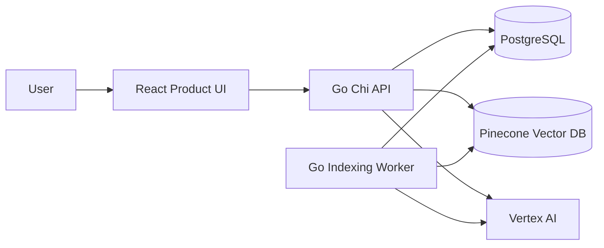
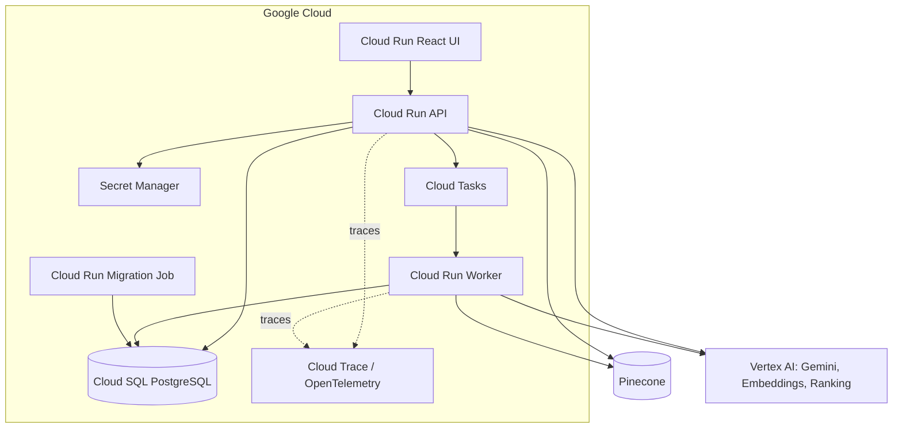
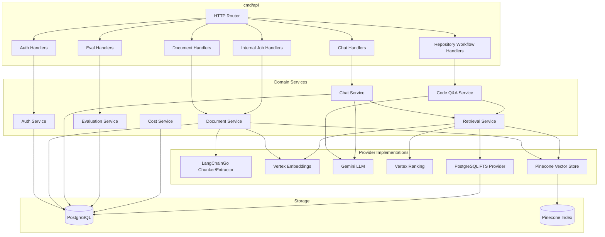
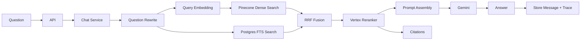
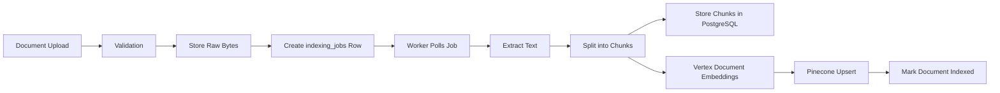

# High-Level Design and Component Design

## System Context

Knowledge Forge is an evidence-grounded RAG and repository-intelligence system.
It turns documents and repository snapshots into searchable chunks, retrieves
relevant evidence for user questions, and uses Gemini to produce cited answers,
deep-dive reports, implementation plans, and impact analyses.

## Deployment HLD

## Main Runtime Components

### React UI

Purpose:

- Provides the primary product frontend for repository import, Q&A, cited
  evidence, deep-dive reports, implementation planning, impact analysis, debug
  traces, and feedback.

Why it exists:

- Makes the North-Star workflow demoable from one focused interface.

If removed:

- The system still works through APIs, but demos become less visual.

### Go Chi API

Purpose:

- Owns HTTP routing, auth, document APIs, chat APIs, debug endpoints, and eval
  endpoints.
- Exposes repository workflow endpoints for Q&A, deep-dive reports, planning,
  and impact analysis.

Why it exists:

- Keeps business workflows behind a production-style backend instead of putting
  logic in the UI.

If removed:

- No stable API surface; UI and workers would have no coordination point.

### Code Q&A Service

Purpose:

- Owns repository Q&A, deep-dive report generation, implementation planning,
  impact analysis, evidence-derived confidence, and Markdown report export.
- Reuses the repository retrieval path rather than introducing a separate agent
  system for reports.

Why it exists:

- Keeps repository intelligence business logic in one backend service with
  citations, traces, provenance, and provider abstractions.

If removed:

- The API could still index repositories, but it could not produce cited
  repository answers, reports, plans, or impact analyses.

### Indexing Worker

Purpose:

- Processes durable indexing jobs.
- Extracts text, chunks documents, generates embeddings, and upserts vectors.

Why it exists:

- Indexing is slow and should not block uploads.

If removed:

- Uploads would either never become searchable or would need to perform expensive
  indexing inline.

### PostgreSQL

Purpose:

- Stores durable relational data:
  - users,
  - documents,
  - chunks,
  - jobs,
  - chat sessions,
  - citations,
  - retrieval traces,
  - eval runs,
  - token cost events.

Why it exists:

- RAG needs durable metadata, transactional state, and keyword search.

If removed:

- The system loses source-of-truth storage, job durability, FTS, chat history,
  and auditability.

### Pinecone

Purpose:

- Stores chunk embeddings and supports semantic nearest-neighbor search.

Why it exists:

- User questions often use different words than the documents. Pinecone finds
  chunks by meaning, not only exact words.

If removed:

- Search becomes keyword-only and misses semantic matches.

### Vertex AI

Purpose:

- Provides:
  - document/query embeddings,
  - Gemini answer generation,
  - ranking/reranking.

Why it exists:

- Centralizes managed model access on Google Cloud.

If removed:

- The system needs replacement providers for embeddings, generation, and
  reranking.

### Provider Layer

Purpose:

- Hides external SDKs behind internal interfaces:
  - `LLMProvider`,
  - `EmbeddingProvider`,
  - `VectorStoreProvider`,
  - `RerankerProvider`,
  - `LexicalSearchProvider`,
  - `ChunkingProvider`,
  - `Retriever`.

Why it exists:

- Keeps core business logic independent of Gemini, Pinecone, LangChainGo, and
  other SDKs.

If removed:

- Business logic becomes tightly coupled to vendors and hard to test.

## Component Diagram

## Request-Time HLD

## Indexing-Time HLD

## Key Design Decisions

| Decision | Reason | Tradeoff |
|---|---|---|
| Go backend | Strong concurrency, typed services, production backend signal | Less AI ecosystem depth than Python |
| Async indexing | Keeps upload fast and durable | Requires jobs and worker operational logic |
| PostgreSQL BYTEA for v1 files | Simple, transactional, fewer services | DB bloat for large files |
| Pinecone vector DB | Managed semantic retrieval | External dependency and cost |
| PostgreSQL FTS | Exact identifier/keyword search | Needs index tuning |
| RRF fusion | Combines dense and lexical rankings safely | Rank-based, not score-calibrated |
| Vertex reranking | Higher precision context | Extra latency and cost |
| Gemini grounded generation | Strong managed LLM | Must guard against hallucination |
| Provider interfaces | Testability and vendor isolation | More upfront structure |
| OpenTelemetry | Production debugging | Requires trace hygiene |
