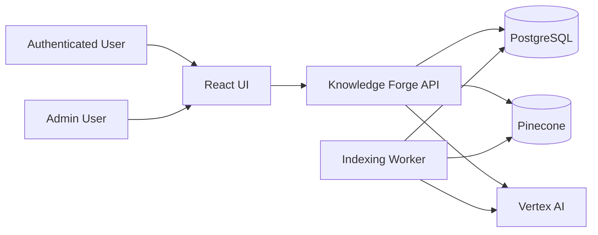
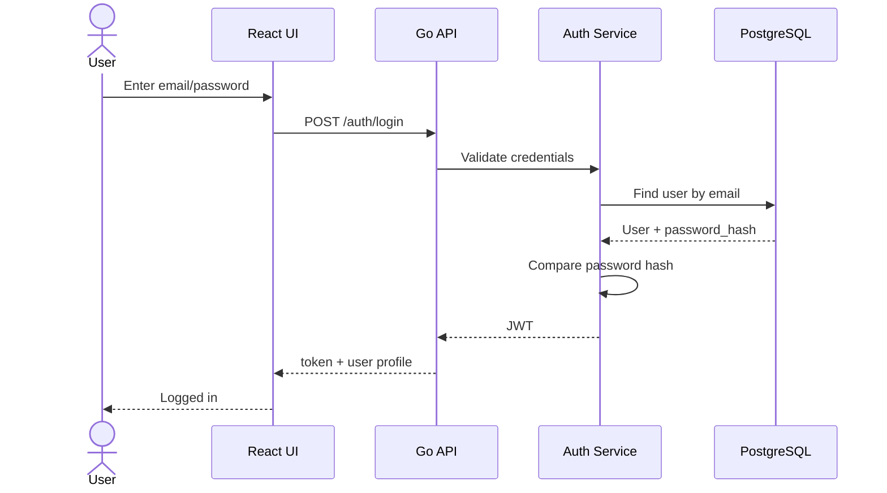
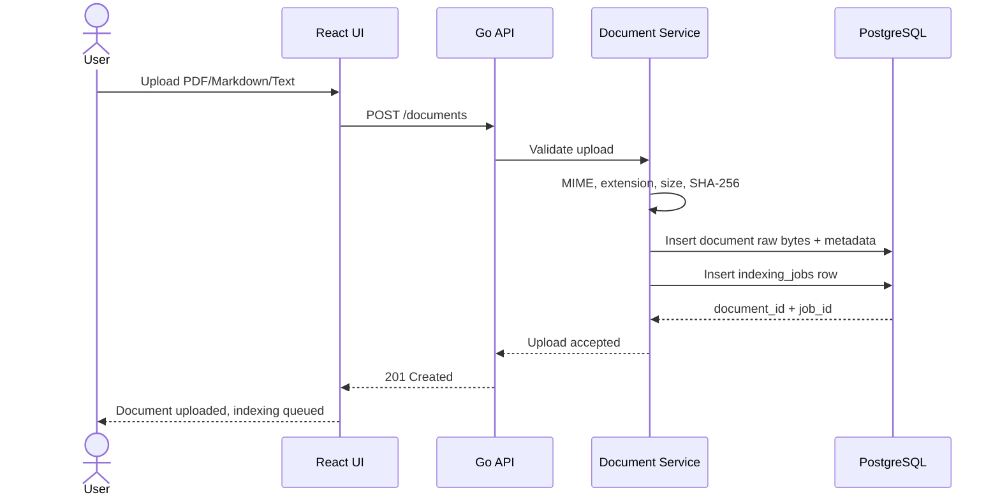
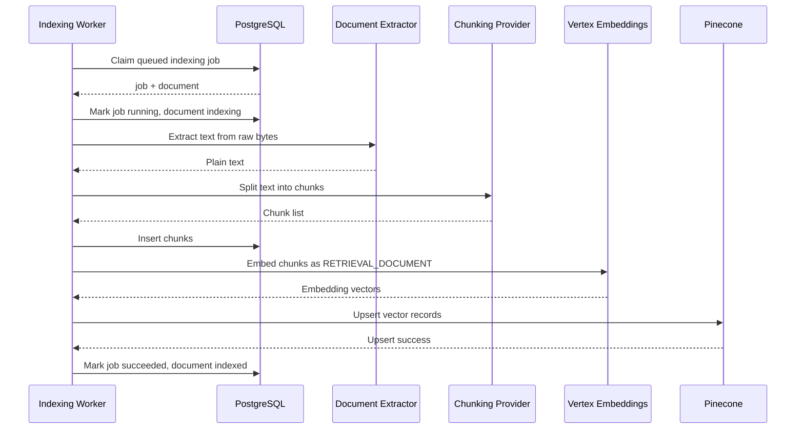
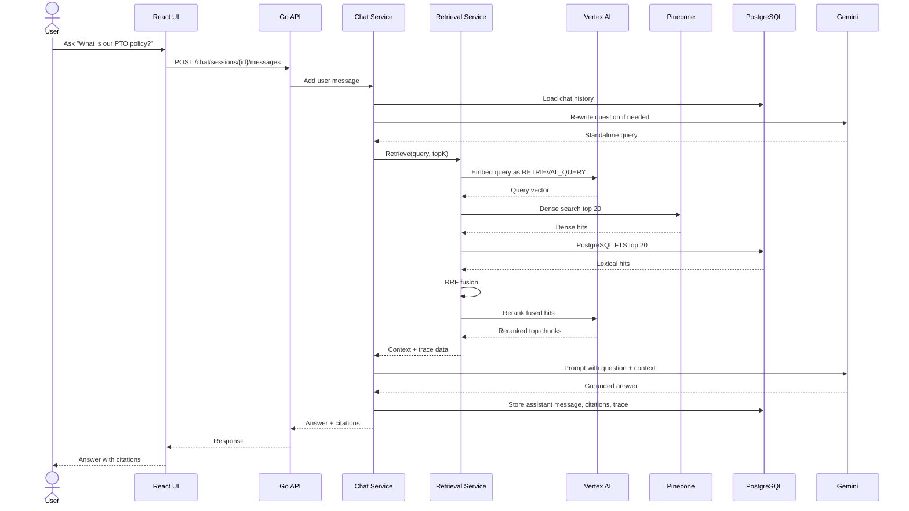
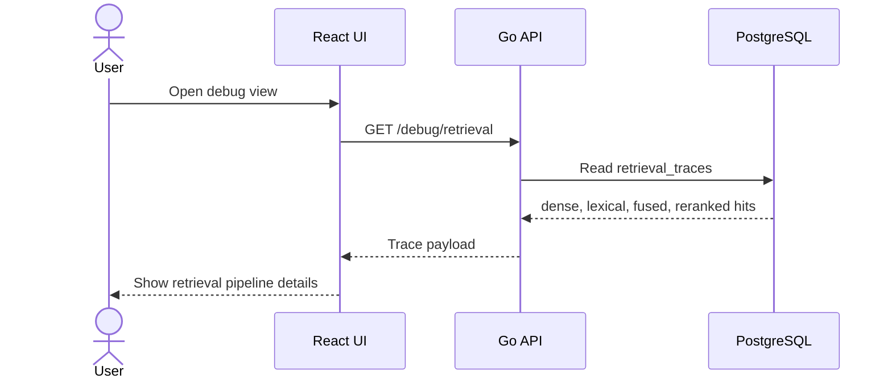
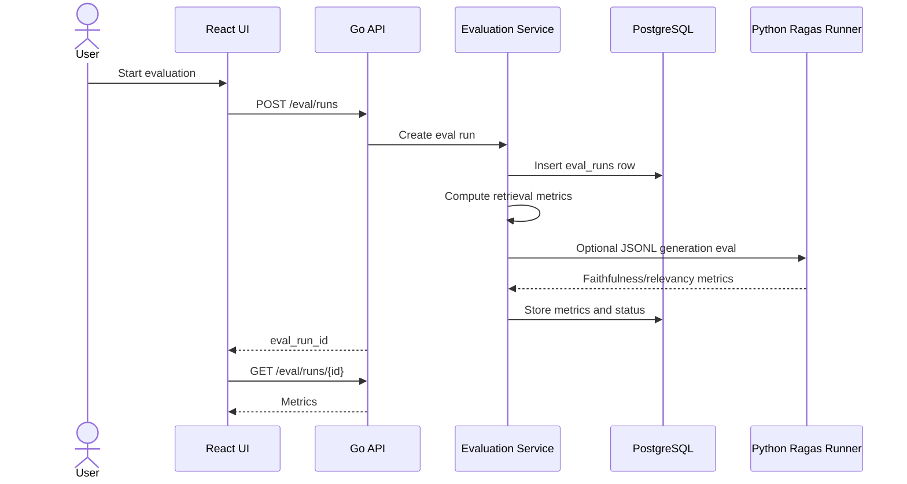
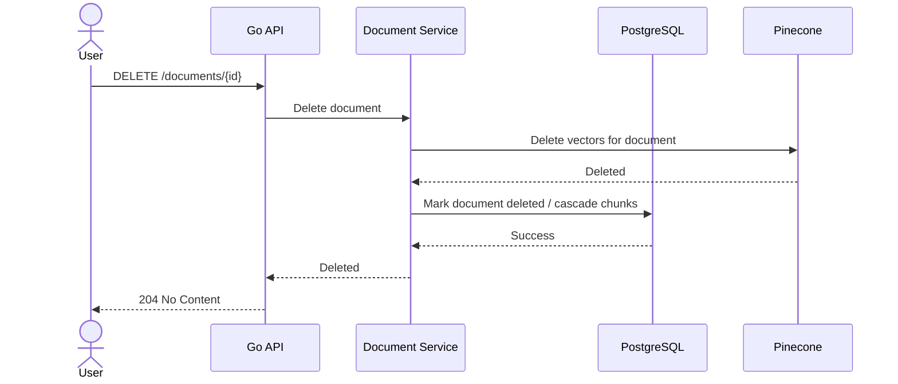
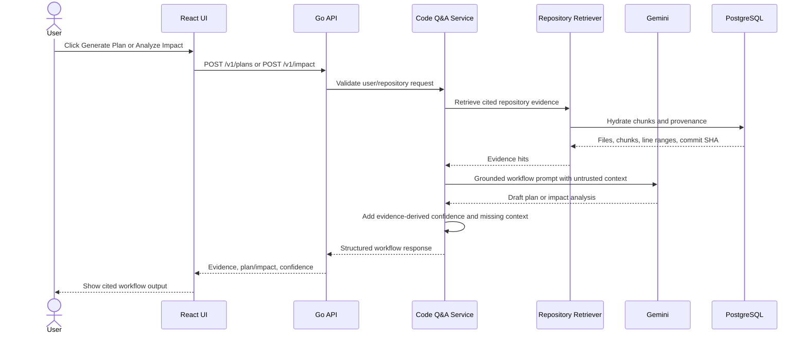
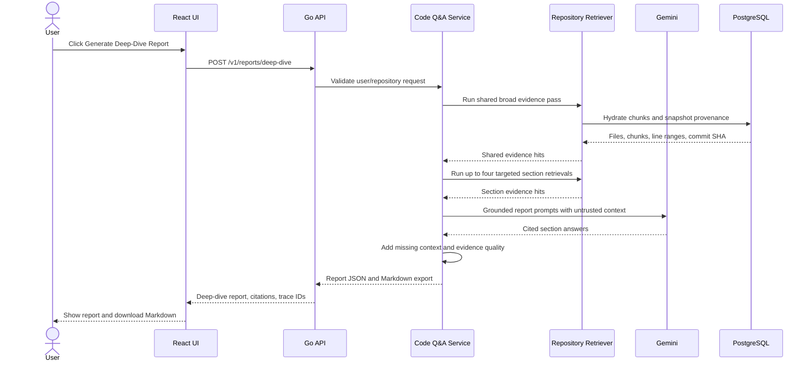

# Use Cases and Sequence Diagrams

## Actors

## Use Case 1: Login

Goal:

- User receives a JWT for protected API calls.

## Use Case 2: Upload Document

Goal:

- Store the file and enqueue indexing without blocking on embeddings.

## Use Case 3: Index Document

Goal:

- Convert raw document bytes into searchable chunks and vectors.

## Use Case 4: Ask a Question

Goal:

- Answer from trusted retrieved context with citations.

## Use Case 5: Debug Retrieval

Goal:

- Understand why a question produced a certain answer.

## Use Case 6: Run Evaluation

Goal:

- Measure retrieval and generation quality.

## Use Case 7: Delete Document

Goal:

- Remove a document and prevent stale citations/retrieval.

## Use Case 8: Generate Repository Plan or Impact Analysis

Goal:

- Turn cited repository evidence into a read-only implementation plan or impact
  analysis without inventing unsupported changes.

## Use Case 9: Generate Repository Deep-Dive Report

Goal:

- Produce a downloadable, cited repository due-diligence report without running
  a separate autonomous agent workflow.

## Use Case Summary

| Use Case | Primary Components | Main Risk |
|---|---|---|
| Login | API, Auth, PostgreSQL | Bad secret/password handling |
| Upload | API, Document Service, PostgreSQL | Unsafe file ingestion |
| Index | Worker, Vertex, Pinecone, PostgreSQL | Provider failures/rate limits |
| Ask | Chat, Retrieval, Vertex, Pinecone, Gemini | Bad retrieval or hallucination |
| Debug | API, retrieval_traces | Missing observability |
| Eval | Evaluation Service, Ragas | Misleading quality metrics |
| Delete | Document Service, Pinecone, PostgreSQL | Stale vectors |
| Plan/Impact | React UI, Code Q&A, Repository Retriever, Gemini | Unsupported recommendations |
| Deep-Dive Report | React UI, Code Q&A, Repository Retriever, Gemini | Expensive or unsupported report claims |
