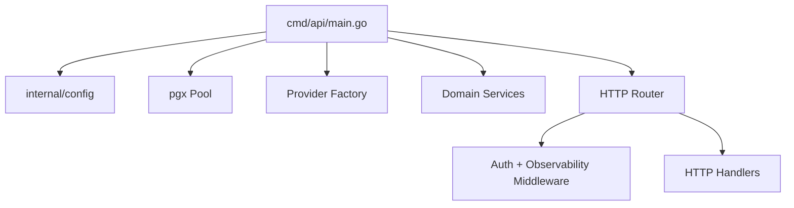
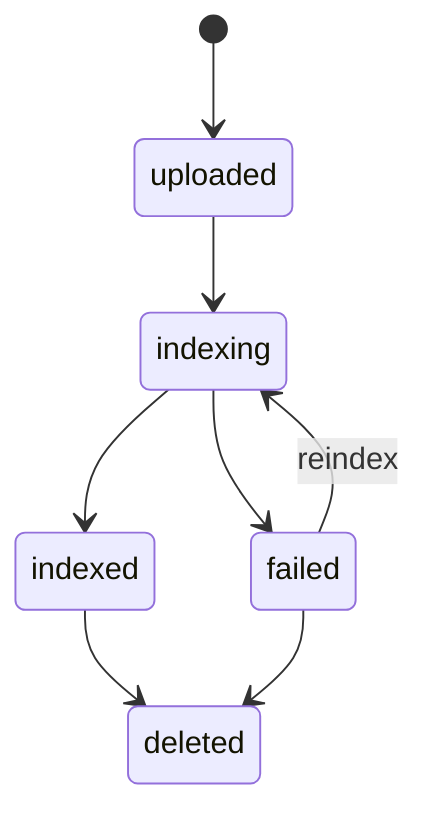
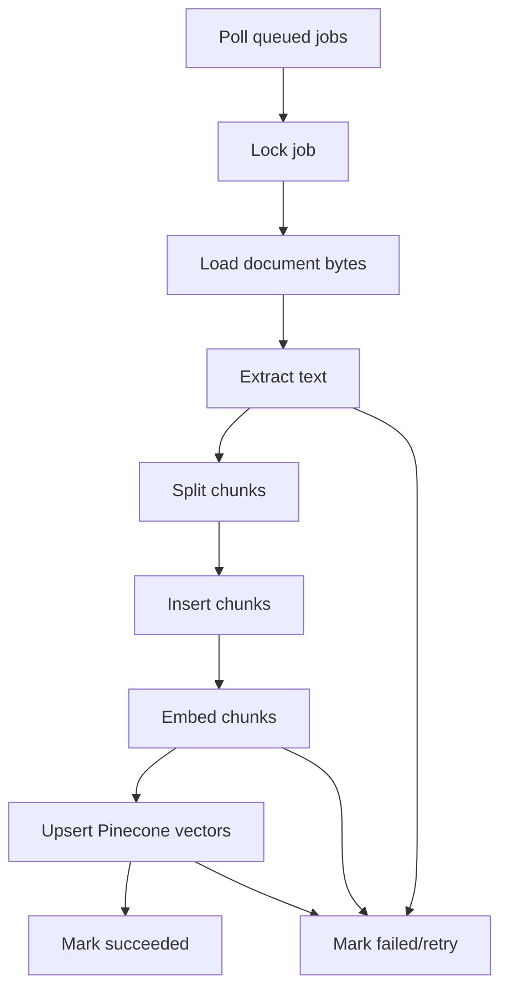

# Low-Level Design

## Code Organization

```text
cmd/
  api/        HTTP server entrypoint
  worker/     indexing worker entrypoint
  migrate/    migration runner

internal/
  auth/          login, JWT, password hashing, middleware
  chat/          chat orchestration and answer persistence
  config/        environment configuration
  costs/         token/cost event recording
  database/      pgx pool creation
  db/            sqlc generated query code
  documents/     upload, validation, document lifecycle
  evaluation/    retrieval metrics and eval run handling
  httpapi/       Chi routes and HTTP handlers
  observability/ logging, tracing, request middleware
  providers/     concrete provider adapters
  rag/           core RAG interfaces and shared types
  retrieval/     dense + lexical retrieval, RRF, reranking
  worker/        indexing job execution
```

## API Layer LLD

The API process starts in `cmd/api/main.go`.

Responsibilities:

- load config,
- connect to PostgreSQL,
- construct providers,
- construct services,
- register routes,
- start HTTP server.



### Handler Pattern

Handlers should stay thin:

```text
parse request
authenticate user
call service
map service result to response
map errors to HTTP status
```

Business logic belongs in services, not handlers.

## Domain Interface LLD

Core interfaces live in `internal/rag`.

```go
type LLMProvider interface {
    GenerateAnswer(ctx context.Context, req GenerateRequest) (GenerateResponse, error)
    RewriteQuestion(ctx context.Context, question string, history []Message) (string, error)
}

type EmbeddingProvider interface {
    EmbedDocuments(ctx context.Context, texts []string) ([]EmbeddingResult, error)
    EmbedQuery(ctx context.Context, text string) (EmbeddingResult, error)
}

type VectorStoreProvider interface {
    UpsertChunks(ctx context.Context, records []VectorRecord) error
    Search(ctx context.Context, vector []float32, topK int, filter map[string]any) ([]RetrievalHit, error)
    DeleteDocument(ctx context.Context, documentID uuid.UUID) error
    Healthcheck(ctx context.Context) error
}
```

Why this matters:

- The retrieval service does not know whether vectors are stored in Pinecone,
  Milvus, or a mock provider.
- The chat service does not know whether generation uses Gemini or another LLM.
- Tests can use mock providers.

## Document Upload LLD

Validation steps:

```text
read multipart file
check size <= max upload bytes
check extension allowlist
check MIME/content type
compute SHA-256
call virus scan hook
insert document
insert indexing job
```

Document states:



## Worker LLD

Worker process starts in `cmd/worker/main.go`.

Main loop:

```text
poll queued jobs
lock a job
load document
mark job running
extract text
chunk text
store chunks
embed chunks
upsert vectors
mark job succeeded
on failure: increment attempts and schedule retry
```



## Retrieval LLD

Retrieval service inputs:

```text
user_id
session_id
query
top_k
reranker_enabled
```

Algorithm:

```text
1. Normalize query.
2. Generate query embedding.
3. Search Pinecone top 20.
4. Hydrate dense hits from PostgreSQL chunks.
5. Search PostgreSQL FTS top 20.
6. Fuse dense and lexical hits using RRF.
7. Rerank fused hits if enabled.
8. Truncate to topK.
9. Return detailed retrieval result.
```

RRF scoring:

```text
score += 1 / (60 + rank)
```

Why rank instead of raw score:

- Pinecone scores and FTS ranks are not directly comparable.
- Rank fusion avoids score normalization problems.

## Chat LLD

Chat request flow:

```text
store user message
load recent chat history
rewrite question if needed
retrieve relevant chunks
assemble prompt
call Gemini
build citations from retrieved chunks
store assistant message
store citations
store retrieval trace
record token/cost event
return answer
```

Prompt principles:

- Retrieved content is evidence, not instructions.
- Gemini should not answer unsupported questions.
- Gemini should cite sources.
- Context should be limited to top reranked chunks.

## Citation LLD

Citations are derived from retrieval hits.

Each citation contains:

```text
chunk_id
document_id
document_name
page_number
excerpt
dense_score
lexical_rank
fused_rank
rerank_score
metadata
```

## Repository Workflow LLD

Phase 16 adds two read-only workflows on top of repository Q&A:

```text
POST /v1/plans
POST /v1/impact
```

Both workflows reuse the repository retrieval path:

```text
request
-> repository ownership check
-> question rewrite
-> adaptive retrieval policy
-> repository dense retrieval
-> optional reranking
-> context assembly
-> Gemini grounded generation
-> structured workflow response
```

Implementation planning response:

```text
Observed Evidence
Recommended Changes
Assumptions
Missing Context
Risks
Tests
Confidence
```

Impact analysis response:

```text
Observed Evidence
Impacted Files
Impacted Symbols
Affected Tests
Dependency Reasoning
Risk Level
Missing Context
Confidence
```

Confidence is evidence-derived. It considers citation count, retrieved file
coverage, context token count, retrieval scores, commit SHA provenance, and
missing-context signals. It is not copied from the model output.

The workflows are read-only. They do not edit code, open PRs, generate diagrams,
or run autonomous agents.

The citation proves which chunk supported the answer.

## Evaluation LLD

Retrieval metrics:

```text
Hit Rate: did any expected document/chunk appear?
Recall@K: did expected evidence appear in top K?
MRR: how high was the first correct hit?
Citation Coverage: does answer include citations?
Latency: how long retrieval took?
Cost: estimated spend per answer?
```

Generation metrics are handled by the Python Ragas runner using JSONL input.

## Error Handling LLD

Expected error categories:

| Area | Example | Handling |
|---|---|---|
| Upload | unsupported MIME | 400 |
| Auth | invalid JWT | 401 |
| Document | not found | 404 |
| Provider | Pinecone timeout | 502/500 or retry in worker |
| Worker | embedding failure | retry with attempts |
| Eval | bad config | failed eval run |

## Observability LLD

Each request should have:

- request ID,
- user ID when available,
- latency,
- route,
- status code.

RAG operations should add spans for:

- embedding,
- Pinecone search,
- FTS search,
- RRF,
- reranking,
- Gemini generation.

Trace hygiene:

- Do not capture full documents by default.
- Avoid storing secrets or raw prompts in telemetry.
- Store prompt preview only when safe and useful.

## Security LLD

Controls:

- JWT authentication.
- Password hashing.
- File size and type validation.
- Duplicate detection using SHA-256.
- Prompt injection defense.
- Secret Manager in production.
- Avoid tracing sensitive full content.
