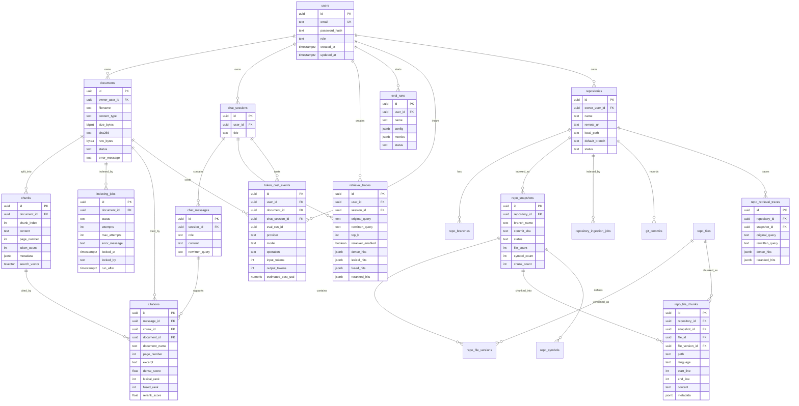
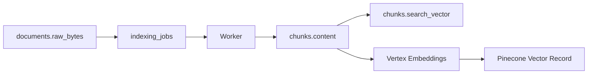
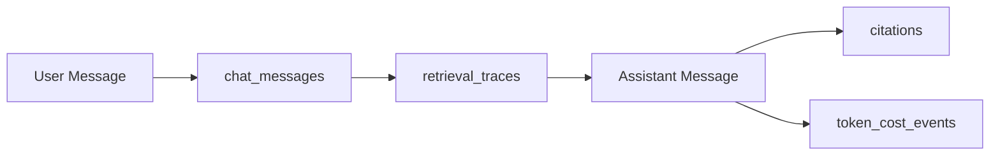

# Database Design and Schema

## Database Role

PostgreSQL is the durable source of truth for Knowledge Forge. It stores users,
documents, chunks, indexing jobs, chat history, citations, retrieval traces, cost
events, evaluation runs, repositories, repository snapshots, repository chunks,
Git commit metadata, and repository retrieval traces.

Pinecone is not the source of truth. Pinecone stores vector records for semantic
search, while PostgreSQL stores the authoritative metadata and text chunks.

## Entity Relationship Diagram

## Table-by-Table Design

### users

Stores authenticated users.

Important columns:

- `email`: unique login identity.
- `password_hash`: hashed password, never raw password.
- `role`: `admin` or `user`.

Why it exists:

- All protected resources are scoped to users.

### documents

Stores uploaded file metadata and raw bytes.

Important columns:

- `owner_user_id`: document owner.
- `filename`: original filename.
- `content_type`: MIME/content type.
- `size_bytes`: upload size.
- `sha256`: duplicate detection.
- `raw_bytes`: source file bytes.
- `status`: upload/index lifecycle.

Constraints:

- `UNIQUE (owner_user_id, sha256)` prevents duplicate uploads per user.
- `size_bytes > 0`.
- `status` is constrained to valid states.

Why BYTEA in v1:

- Simple local setup.
- Transactional file + metadata insert.
- Fewer cloud services.

Production evolution:

- Move raw bytes to GCS.
- Keep metadata, checksum, object URI, and status in PostgreSQL.

### chunks

Stores searchable document chunks.

Important columns:

- `document_id`: parent document.
- `chunk_index`: stable order within document.
- `content`: chunk text.
- `page_number`: source page when available.
- `token_count`: approximate size.
- `metadata`: provider/file metadata.
- `search_vector`: generated PostgreSQL FTS vector.

Indexes:

- `chunks_search_vector_idx`: GIN index for FTS.
- `chunks_document_id_idx`: fast document-to-chunks lookup.

Why it exists:

- Chunks are the core evidence unit used for retrieval and citations.

### repositories

Stores repository registrations owned by users.

Important columns:

- `owner_user_id`: repository owner.
- `remote_url`: Git remote used for clone-based ingestion.
- `local_path`: local path used for local demos and smoke tests.
- `default_branch`: branch used when ingestion does not specify one.
- `status`: active/archive/delete lifecycle.

Constraints:

- Either `remote_url` or `local_path` must be present.
- `(owner_user_id, name)` is unique.

### repo_snapshots

Stores immutable indexing runs for one repository branch and commit SHA.

Why it exists:

- Every repository answer and benchmark result must be reproducible against the
  exact source state that was indexed.

### repo_file_versions and repo_file_chunks

`repo_file_versions` stores file content captured in a snapshot.
`repo_file_chunks` stores retrievable evidence units with file path and line
range metadata.

Why they exist:

- Pinecone stores vectors, but PostgreSQL remains the source of truth for code
  text, line ranges, citations, and vector rebuilds.

### indexing_jobs

Durable job queue for document indexing.

Important columns:

- `document_id`: document to process.
- `status`: queued/running/succeeded/failed/cancelled.
- `attempts`: retry count.
- `max_attempts`: retry limit.
- `locked_at`, `locked_by`: worker ownership.
- `run_after`: scheduled retry time.

Index:

- `(status, run_after)` supports polling due jobs efficiently.

Why it exists:

- Upload should not block on extraction, embeddings, or Pinecone upsert.

### repository_ingestion_jobs

Durable job queue for repository indexing.

Why it exists:

- Repository indexing can be run asynchronously by the worker or synchronously
  in local smoke tests with `process_now=true`.

### repo_retrieval_traces

Stores repository Q&A retrieval evidence.

Why it exists:

- Debugging repository answers requires seeing the dense candidates, reranked
  context, prompt preview, and latency for the exact snapshot.

### chat_sessions

Groups chat messages.

Why it exists:

- Enables conversational memory and follow-up question rewriting.

### chat_messages

Stores user and assistant messages.

Important columns:

- `role`: user or assistant.
- `content`: message text.
- `rewritten_query`: standalone query used for retrieval.

Why it exists:

- Preserves conversation history and lets the system rewrite questions like
  “What about contractors?” into a standalone query.

### citations

Stores evidence attached to assistant messages.

Why it exists:

- Makes answers auditable.
- Preserves source details even after answer generation.

### retrieval_traces

Stores retrieval debugging payloads.

Important JSON fields:

- `dense_hits`
- `lexical_hits`
- `fused_hits`
- `reranked_hits`

Why it exists:

- Helps debug bad answers by showing what the retriever found at each stage.

### token_cost_events

Tracks estimated model/provider cost.

Important columns:

- `provider`
- `model`
- `operation`
- `input_tokens`
- `output_tokens`
- `estimated_cost_usd`

Why it exists:

- RAG systems need cost observability because embeddings, reranking, and
  generation all create usage-based cost.

### eval_runs

Stores evaluation runs.

Important columns:

- `config`: evaluation configuration.
- `metrics`: computed metrics.
- `status`: queued/running/succeeded/failed.

Why it exists:

- Keeps evaluation repeatable and inspectable.

## Physical Schema

Current schema source:

- `migrations/00001_initial_schema.sql`

Generated query code:

- `internal/db/*.sql.go`

SQL query definitions:

- `queries/*.sql`

## Indexing Strategy

| Index | Purpose |
|---|---|
| `chunks_search_vector_idx` | Full-text search over chunk content |
| `chunks_document_id_idx` | Fetch chunks for a document |
| `indexing_jobs_status_run_after_idx` | Worker polling |
| `chat_messages_session_id_created_at_idx` | Load chat history in order |

## Data Flow: Upload to Search

## Data Flow: Answer Persistence

## Schema Tradeoffs

### BYTEA vs GCS

`BYTEA` benefits:

- simple v1,
- transactional,
- easy local development.

`BYTEA` drawbacks:

- database grows quickly,
- backups become heavier,
- less suitable for very large files.

GCS benefits:

- better large-file storage,
- lifecycle policies,
- cheaper blob storage,
- avoids DB bloat.

### JSONB for Trace Payloads

Benefits:

- flexible shape for dense/lexical/fused/reranked hits,
- easy to evolve during early product development.

Drawbacks:

- weaker schema guarantees,
- harder analytics at large scale.

### Generated FTS Vector

Benefits:

- always consistent with chunk content,
- efficient GIN index search.

Drawbacks:

- English configuration may need tuning for multilingual documents.
