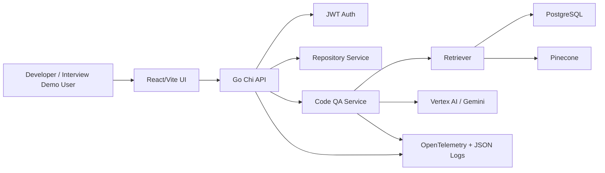
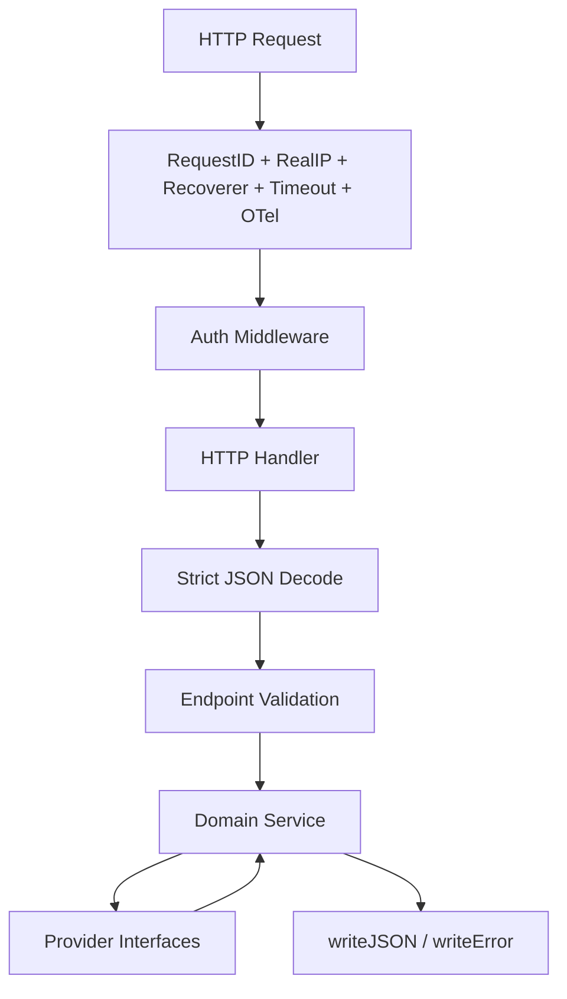
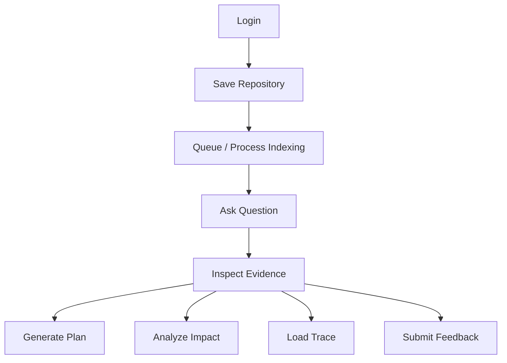
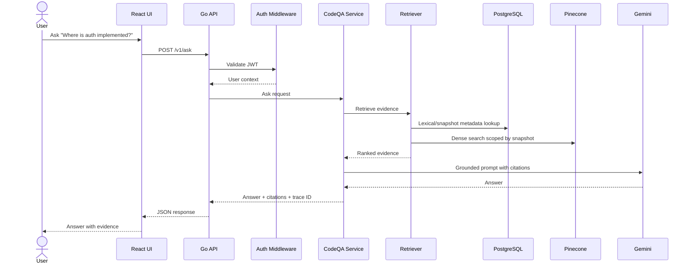
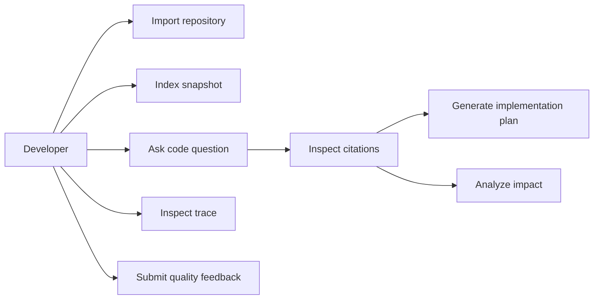

# UI and Backend Quality Guide

This document records the quality bar for the Knowledge Forge product UI and Go backend. It complements the HLD, LLD, sequence, use-case, and database design docs by turning best practices into concrete implementation rules.

## Quality Goals

- Keep the UI operational and evidence-focused, not decorative.
- Keep backend handlers thin: validate input, call services, return typed JSON.
- Keep business logic behind internal services and provider interfaces.
- Return safe, predictable API responses that the UI can parse cleanly.
- Preserve observability without logging full prompts, document text, or secrets.
- Make every user-visible claim traceable to retrieved evidence and repository provenance.

## UI Best Practices

- Use a task-first layout: repository import, indexing, Q&A, evidence, plan, impact, and developer tools.
- Keep state explicit with separate values for token, repository, ingestion job, answer, plan, impact, trace, busy state, and error state.
- Disable actions while their request is in flight.
- Parse API error envelopes so users see `invalid JSON body` instead of raw JSON strings.
- Send `Content-Type: application/json` only when a body exists.
- Treat empty `204` responses as valid success responses.
- Keep benchmark/debug views under Developer Tools instead of making them the primary workflow.
- Keep evidence and citations close to the answer so the product remains grounded.

## Backend Best Practices

- Use Chi middleware for request IDs, real IPs, panic recovery, timeouts, logging, and tracing.
- Decode JSON through a shared helper with:
  - 1 MB body limit.
  - unknown field rejection.
  - multiple JSON value rejection.
  - optional-body support where the endpoint allows an empty body.
- Return JSON responses with `application/json; charset=utf-8`.
- Set `X-Content-Type-Options: nosniff`.
- Keep internal business logic out of HTTP handlers.
- Keep LangChainGo, Vertex, Pinecone, and external SDKs behind internal provider interfaces.
- Keep repository answers tied to repository ID, branch, snapshot, commit SHA, retrieved chunks, retrieval config, and model versions.
- Avoid tracing full prompts or full document/code contents by default.

## HLD: UI and Backend Boundary



## LLD: Backend Request Handling



## Frontend Flow



## Sequence: Repository Q&A



## Use-Case Diagram



## API Response Contract

Successful responses:

```json
{
  "answer": "The authentication flow is implemented in ...",
  "citations": [],
  "trace_id": "..."
}
```

Error responses:

```json
{
  "error": "invalid JSON body"
}
```

Frontend handling rules:

- Prefer structured `error` or `message` fields.
- Fall back to response text for non-JSON failures.
- Fall back to HTTP status if the response has no body.
- Preserve HTTP status and request path on `ApiError`.

## Quality Gates

Before merging UI/backend changes, run:

```bash
go test ./...
go vet ./...
python3 -m pytest eval-runner
python3 -m py_compile ui/streamlit/app.py eval-runner/repo_benchmark_runner.py
cd ui/web && npm test && npm run lint && npm run build
docker compose config
```

When Docker is running, also run:

```bash
docker compose up --build -d
docker compose ps
docker compose down
```

## Review Checklist

- Does the UI show evidence beside answers?
- Are buttons disabled while the matching request is in flight?
- Are API errors human-readable?
- Are JSON request bodies bounded and strict?
- Are handlers free of provider SDK logic?
- Are repository answers tied to commit SHA and trace ID?
- Are logs/traces useful without leaking sensitive content?
- Are diagrams and docs updated when architecture changes?
