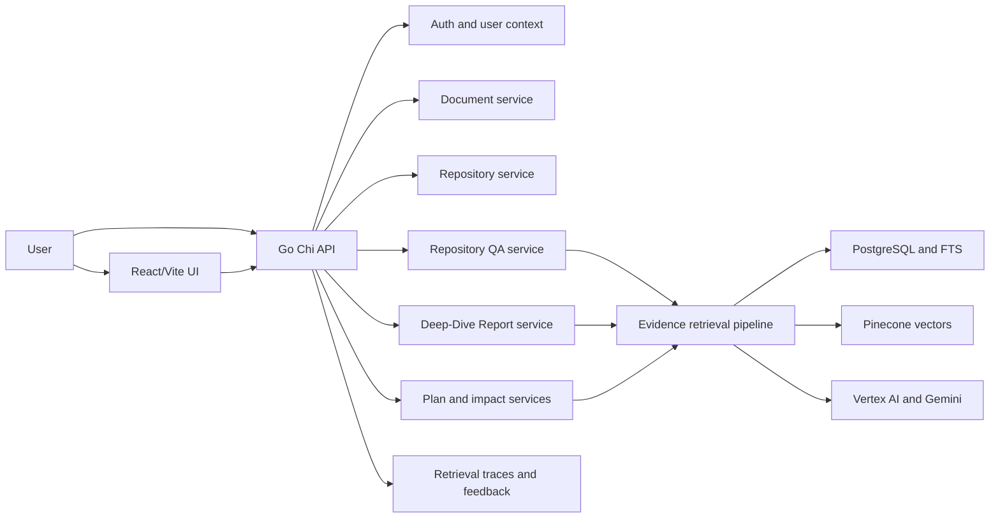
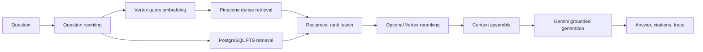
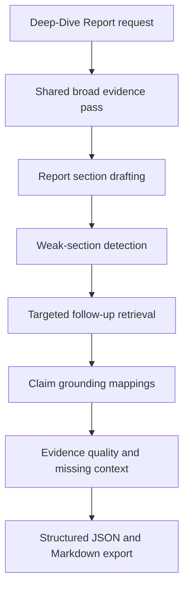
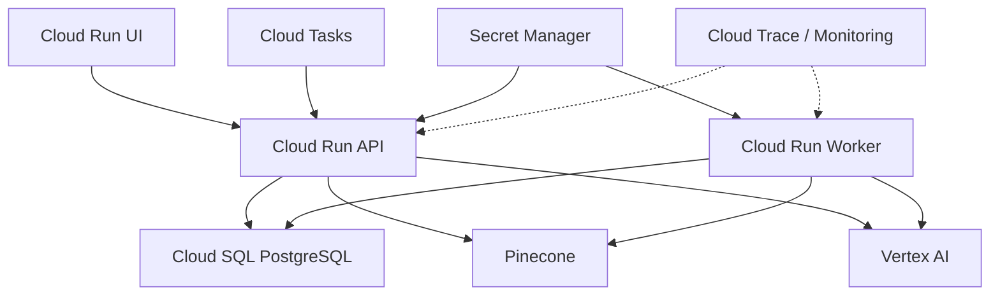

# Knowledge Forge Architecture

Knowledge Forge is an evidence-grounded repository intelligence system. It has
two related paths:

- document RAG for uploaded source documents
- repository intelligence for codebase Q&A, Deep-Dive Reports, read-only
  implementation plans, and impact analysis

The architecture is designed around one rule:

```text
Claims require evidence.
```

That rule affects retrieval, support gates, report generation, traces,
benchmarks, and security boundaries.

## System Context



## Runtime Components

| Component | Responsibility |
| --- | --- |
| React/Vite UI | Primary product surface for repository import, Q&A, evidence, reports, planning, impact analysis, feedback, and Markdown export. |
| Streamlit fallback | Lightweight fallback/demo surface under `ui/streamlit`. |
| Go Chi API | HTTP API, auth, request validation, service orchestration, trace access, and internal worker routes. |
| Worker | Async indexing and repository ingestion job processing. |
| PostgreSQL | Relational source of truth for users, documents, repositories, snapshots, files, chunks, traces, feedback, jobs, and lexical search. |
| Pinecone | Dense vector retrieval. |
| Vertex AI | Query embeddings, optional reranking, and Gemini generation. |
| Python eval-runner | Acceptance validation, benchmark scoring, baseline comparisons, and proof-report generation. |

## Repository Intelligence Model

```text
Repository
+-- Branch
    +-- Snapshot(commit SHA)
        +-- Files
        +-- Chunks
        +-- Symbols
        +-- Graph
```

The repository snapshot is the evidence boundary. Repository answers should be
traceable to a commit SHA, file paths, line ranges, excerpts, and retrieved
chunks.

The `Graph` part of the model records future-facing structure, but graph
retrieval is not a selected implementation direction. Phase 18.5 did not find
dominant graph-specific failures, so graph retrieval remains rejected until
benchmark evidence changes.

## Document RAG Flow



Document RAG supports the original knowledge-base path. It is useful for
uploaded policies, project notes, and supporting documents.

## Repository Q&A Flow

```mermaid
flowchart LR
  Q["Repository question"] --> Classifier["Query classification"]
  Classifier --> Policy["Adaptive retrieval budget"]
  Policy --> Retrieval["Repository and snapshot scoped retrieval"]
  Retrieval --> Support["Evidence support gate"]
  Support --> Context["Required-evidence-aware context assembly"]
  Context --> Generation["Grounded generation"]
  Generation --> Output["Answer, citations, trace, feedback target"]
```



Repository Q&A differs from generic RAG in two important ways:

1. Evidence must belong to the requester and the selected repository snapshot.
2. Evidence must actually support the question.

Example:

```text
evidence exists != evidence supports the question
```

A payroll UI question cannot be supported by a random UI file. A revenue API
question cannot be supported by a generic API handler. The support gate should
refuse when the evidence does not satisfy the question.

## Deep-Dive Report Flow



Deep-Dive Reports are generated on demand. They are not persisted as first-class
database objects in v1. Durable review data comes from repository snapshots,
citations, retrieval traces, line ranges, and claim-grounding mappings.

## Planning And Impact Analysis

Implementation planning and impact analysis are read-only workflows. They reuse
the repository evidence pipeline and return structured outputs such as:

- observed evidence
- recommended changes
- impacted files
- missing context
- test considerations
- risks
- confidence derived from evidence

The system does not mutate code, create PRs, generate patches, or run agents.

## Security Boundaries

Security hardening is part of the architecture, not an afterthought.

Current validated boundaries include:

- dense retrieval hydration requires requester ownership and indexed document
  status
- PostgreSQL FTS retrieval is owner-scoped
- retrieval traces are owner-scoped
- refused answers redact hydrated retrieval evidence and prompt previews
- deleted documents cannot become retrievable through stale indexing workers
- repository ingestion skips symlink escapes
- hosted deployments reject local repository paths by default
- remote repository URLs are limited to approved HTTPS Git hosts
- internal worker routes require `INTERNAL_WORKER_TOKEN`
- oversized multipart uploads are capped before multipart parsing

Proof:

- [Phase 18.6 Security Remediation](proof/phase18-6-security-remediation.md)
- [Phase 18.8 Security Hardening](proof/phase18-8-security-hardening.md)

## Provider Boundaries

Core business logic depends on interfaces rather than direct cloud SDK calls.
Provider implementations live under `internal/providers`.

Important provider categories:

- LLM generation
- embeddings
- vector store
- reranking
- lexical search
- chunking
- retrieval orchestration

This keeps tests and local development viable with mock providers while leaving
the production path open for Vertex AI, Pinecone, and managed GCP services.

## Data And Storage

v1 stores uploaded source files in PostgreSQL `BYTEA`. This keeps local and
Cloud Run setup simple and makes upload plus metadata changes transactional.

For larger production deployments, raw file bytes should move to GCS while
PostgreSQL keeps:

- document metadata
- object URI
- checksum
- indexing state
- ownership
- citations and trace references

See [Storage Notes](storage.md).

## Deployment Shape



The documented production target is Google Cloud Run with Cloud SQL, Secret
Manager, Cloud Tasks, Vertex AI, Pinecone, and Cloud Trace/Monitoring.

See:

- [Deployment Overview](../deploy/README.md)
- [Cloud Run Deployment](../deploy/cloud-run.md)

## Evaluation Architecture

The Python `eval-runner` owns the benchmark and acceptance reporting surface.
It evaluates saved candidate outputs against frozen fixtures and baselines.

Validation layers:

- acceptance gates for refusal, answer relevance, architecture evidence, metric
  integrity, label completeness, and adversarial behavior
- Phase 18 benchmark proof against keyword and retrieval-only baselines
- Phase 18.5 multi-corpus benchmark proof
- benchmark leakage review to ensure runtime product code does not reference
  benchmark labels or outputs
- release-readiness and security proof docs

Current roadmap decision:

```text
Proceed with Larger Corpus Expansion
```

The independent challenge review approved that decision with reservations. The
next work should gather broader corpus evidence, not add graph retrieval,
Repository Structure Indexing, or Static Code Intelligence by default.
