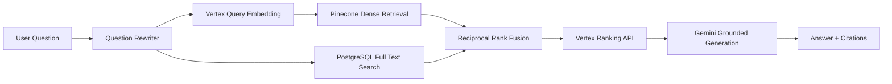

# RAG-bot Architecture

RAG-bot is a production-style company-document question answering system.

The Go service owns API, orchestration, auth, persistence, worker coordination,
retrieval observability, and cost accounting. Provider SDKs are hidden behind
internal interfaces so the core business logic does not depend on Vertex,
Pinecone, LangChainGo, or Ragas directly.

Hybrid retrieval uses Pinecone for dense semantic recall and PostgreSQL FTS for
exact identifiers, acronyms, filenames, and policy names. Reciprocal Rank Fusion
combines both candidate sets before reranking.

## Evaluation

The Go API computes retrieval metrics: Hit Rate, Recall@K, MRR, retrieval
latency, and citation coverage. The Python `eval-runner` owns the Ragas JSONL
contract for generation metrics: faithfulness, answer relevancy, context
precision, and context recall.

## Provider Boundaries

Core business logic depends on interfaces in `internal/rag`:

- `LLMProvider`
- `EmbeddingProvider`
- `VectorStoreProvider`
- `RerankerProvider`
- `LexicalSearchProvider`
- `ChunkingProvider`
- `Retriever`

Implementations live under `internal/providers`. LangChainGo is currently used
only by the chunking adapter.

## Document Storage

v1 stores uploaded source files in PostgreSQL `BYTEA`. This keeps local and
Cloud Run setup small and makes upload + metadata changes transactional. For
larger production deployments, raw file bytes should move to GCS while
PostgreSQL keeps document metadata, object URI, checksum, and indexing state.
