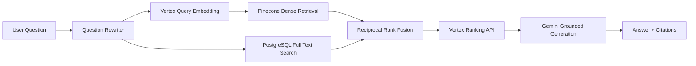

# RAG-bot Architecture

RAG-bot is a production-style company-document question answering system.

The Go service owns API, orchestration, auth, persistence, worker coordination,
retrieval observability, and cost accounting. Provider SDKs are hidden behind
internal interfaces so the core business logic does not depend on Vertex,
Pinecone, LangChainGo, or Ragas directly.

