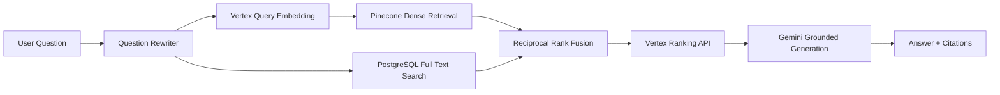
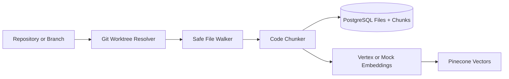
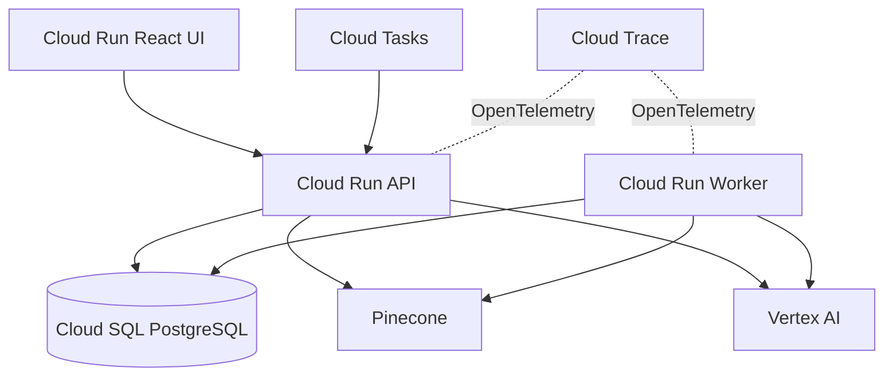

# Knowledge Forge Architecture

Knowledge Forge is a production-style evidence-grounded knowledge assistant. It
supports the original company-document RAG path and now includes a focused
repository-intelligence MVP for cited codebase Q&A.



## Repository Intelligence MVP

```mermaid
flowchart LR
  Q[Repository Question] --> QC[Query Classifier]
  QC --> RP[Adaptive Retrieval Policy]
  RP --> QE[Query Embedding]
  QE --> P[Pinecone Dense Retrieval]
  P --> H[Hydrate Chunks from PostgreSQL]
  H --> RR{Reranker Enabled?}
  RR -->|yes| V[Vertex Ranking API]
  RR -->|no| CTX[Context Assembly]
  V --> CTX
  CTX --> B[Token Budgeted Evidence]
  B --> G[Gemini Grounded Generation]
  G --> A[Answer + File/Line Citations]
  A --> W[Read-only Plan or Impact Analysis]
  A --> T[Trace + Provenance + Cost]
  W --> E[Evidence-derived Confidence]
```





Repository model:

```text
Repository
└── Branch
    └── Snapshot(commit SHA)
        ├── Files
        ├── Chunks
        ├── Symbols
        └── Graph
```

Phase 12 freezes the repository retrieval MVP at dense retrieval scoped by
repository and snapshot metadata. Lexical, symbol, and static graph retrieval
remain future benchmarked improvements rather than default behavior.



The Go service owns API, orchestration, auth, persistence, worker coordination,
retrieval observability, and cost accounting. Provider SDKs are hidden behind
internal interfaces so the core business logic does not depend on Vertex,
Pinecone, LangChainGo, or Ragas directly.

The primary UI is a React/Vite product surface focused on the North-Star
workflow. It keeps repository import, question, evidence, plan outline, impact
analysis, trace/provenance, and structured feedback in one demo-oriented flow.
The Streamlit UI remains in `ui/streamlit` as a fallback.

Hybrid retrieval uses Pinecone for dense semantic recall and PostgreSQL FTS for
exact identifiers, acronyms, filenames, and policy names. Reciprocal Rank Fusion
combines both candidate sets before reranking.

Repository Q&A uses Pinecone dense retrieval in this milestone. Every repository
answer is tied to a repository, branch, immutable commit SHA snapshot, retrieved
chunk IDs, file path, and line range. The context is treated as untrusted input;
unsupported claims should be refused rather than invented.

Phase 14 adds adaptive retrieval policy before repository generation. The policy
classifies the question, chooses candidate depth, decides whether reranking is
worth the extra latency/cost, and sets the context token budget. Context
assembly then collapses adjacent chunks from the same file and trims the final
evidence set before Gemini sees it. Retrieval traces persist the policy,
retrieval path, stage contributions, retrieved chunk IDs, prompt version, model,
latency, and estimated cost.

Phase 16 adds two constrained repository workflows: implementation planning and
impact analysis. Both call the same evidence-grounded repository retrieval path
as Q&A, then return structured sections such as observed evidence, recommended
changes, missing context, tests, impacted files, and risks. Confidence is
derived from citations, retrieval scores, context volume, commit provenance, and
missing-context signals; it is not model self-confidence. The workflows are
read-only and do not mutate code, open PRs, or run autonomous agents.

## Repository Ingestion Safety

Repository ingestion skips symlinks, ignored build/dependency directories,
binary files, unsupported extensions, empty files, and files above the MVP size
limit. Remote clones run with a timeout. Local paths are normalized before
walking so path traversal and accidental out-of-root reads are avoided.

## Evaluation

The Go API computes retrieval metrics: Hit Rate, Recall@K, MRR, retrieval
latency, and citation coverage. The Python `eval-runner` owns the Ragas JSONL
contract for generation metrics: faithfulness, answer relevancy, context
precision, and context recall.

## Provider Boundaries

Core business logic depends on interfaces in `internal/rag`:

- `LLMProvider`
- `EmbeddingProvider`
- `VectorStoreProvider`
- `RerankerProvider`
- `LexicalSearchProvider`
- `ChunkingProvider`
- `Retriever`

Implementations live under `internal/providers`. LangChainGo is currently used
only by the chunking adapter.

## Document Storage

v1 stores uploaded source files in PostgreSQL `BYTEA`. This keeps local and
Cloud Run setup small and makes upload + metadata changes transactional. For
larger production deployments, raw file bytes should move to GCS while
PostgreSQL keeps document metadata, object URI, checksum, and indexing state.
